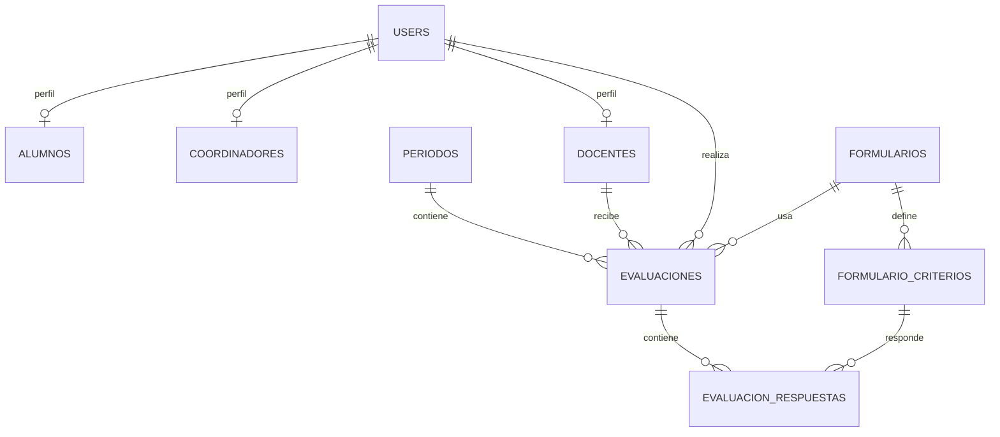

# Prompt de Implementacion: Sistema de Evaluacion Docente

Usa este documento como instruccion base para implementar en otro proyecto un modulo de evaluacion docente.

## Rol

Actua como un ingeniero de software senior. Antes de escribir codigo, inspecciona el proyecto destino y adapta la implementacion al stack existente. No fuerces patrones que contradigan la arquitectura actual.

## Objetivo funcional

Implementar un sistema de evaluacion docente con estas reglas:

- Existen alumnos, coordinadores y docentes.
- Los alumnos evaluan a los docentes.
- Los coordinadores evaluan a los docentes.
- Los alumnos y los coordinadores usan formularios distintos.
- Todos los docentes son evaluados con los mismos parametros dentro de cada formulario; no existen grupos ocupacionales ni variantes por tipo de docente.
- El sistema debe permitir registrar respuestas por criterio, calcular un puntaje total y consultar evaluaciones por periodo.

## Restricciones de negocio

- No reutilizar la logica de grupos ocupacionales.
- No modelar criterios por grupo ni por cargo.
- La variacion del formulario depende del tipo de evaluador, no del docente.
- Debe existir al menos un formulario para `alumno -> docente` y otro para `coordinador -> docente`.
- Una evaluacion debe guardar quien evaluo, a que docente evaluo, en que periodo, con que formulario y cuales fueron sus respuestas.
- El puntaje total debe calcularse a partir de las respuestas y los pesos de cada criterio.

## Modelo de datos recomendado

Implementa el modulo usando un modelo cabecera-detalle con formularios parametrizables.

## Entidades esperadas

Adapta estos nombres a la nomenclatura del proyecto destino si hace falta.

### 1. users

Tabla de autenticacion existente del proyecto.

### 2. alumnos

Campos minimos sugeridos:

- `id`
- `user_id`
- campos academicos que ya existan en el proyecto, por ejemplo `carrera_id`, `curso_id`, `seccion_id`

### 3. coordinadores

Campos minimos sugeridos:

- `id`
- `user_id`
- ambito de coordinacion, por ejemplo `carrera_id`, `departamento_id`, `sede_id`

### 4. docentes

Campos minimos sugeridos:

- `id`
- `user_id`
- datos academicos o laborales relevantes, por ejemplo `departamento_id`, `carrera_id`, `activo`

### 5. periodos

Campos sugeridos:

- `id`
- `nombre`
- `fecha_inicio`
- `fecha_fin`
- `activo`

### 6. formularios

Representa la plantilla general del formulario.

Campos sugeridos:

- `id`
- `nombre`
- `tipo_evaluador` con valores equivalentes a `alumno` y `coordinador`
- `descripcion` nullable
- `activo`

Ejemplos iniciales:

- `Evaluacion docente por alumno`
- `Evaluacion docente por coordinador`

### 7. formulario_criterios

Representa cada pregunta o criterio dentro de un formulario.

Campos sugeridos:

- `id`
- `formulario_id`
- `pregunta`
- `descripcion` nullable
- `peso`
- `orden`
- `tipo_respuesta` por ejemplo `escala`, `texto`, `mixto`
- `obligatoria`
- `activo`

### 8. evaluaciones

Cabecera de la evaluacion.

Campos sugeridos:

- `id`
- `periodo_id`
- `formulario_id`
- `docente_id`
- `evaluador_user_id`
- `tipo_evaluador`
- `puntaje_total`
- `estado`
- `fecha_envio` nullable
- `created_at`
- `updated_at`

### 9. evaluacion_respuestas

Detalle de respuestas por criterio.

Campos sugeridos:

- `id`
- `evaluacion_id`
- `formulario_criterio_id`
- `valor_numerico` nullable
- `valor_texto` nullable
- `observacion` nullable
- `created_at`
- `updated_at`

## Reglas de integridad recomendadas

Implementa estas restricciones en base de datos siempre que el stack lo permita:

- `unique(periodo_id, formulario_id, docente_id, evaluador_user_id)` en `evaluaciones` para evitar evaluaciones duplicadas del mismo evaluador al mismo docente en el mismo periodo y formulario.
- `unique(evaluacion_id, formulario_criterio_id)` en `evaluacion_respuestas` para evitar respuestas duplicadas del mismo criterio.
- Foreign keys en todas las relaciones principales.
- Validacion para que `tipo_evaluador` en `evaluaciones` coincida con `tipo_evaluador` del `formulario` usado.
- Validacion para que la suma de `peso` de los criterios activos de cada formulario sea 100 si el proyecto usa promedio ponderado sobre 100.

Si el motor soporta `check constraints`, agrega checks para:

- `peso >= 0`
- `puntaje_total >= 0`
- valores validos de `tipo_evaluador`

## Reglas de aplicacion

Implementa estas reglas en la capa de negocio:

- Un alumno solo debe poder evaluar docentes habilitados para su contexto academico.
- Un coordinador solo debe poder evaluar docentes dentro de su ambito de coordinacion.
- Si el proyecto destino ya tiene tablas como matriculaciones, asignaciones, materias, cursos o departamentos, usa esas relaciones para determinar a quien puede evaluar cada usuario.
- Si no existe una relacion explicita entre coordinador y docente, crea la minima estructura necesaria para representarla correctamente.
- No permitas que un formulario de `coordinador` sea usado por un `alumno` ni viceversa.
- No permitas guardar una evaluacion incompleta si el formulario requiere todos los criterios obligatorios.
- Recalcula `puntaje_total` desde las respuestas; no lo trates como dato manual.

## Logica del puntaje

Implementa el puntaje total como promedio ponderado sobre criterios numericos. La formula sugerida es:

$$
puntaje\_total = \frac{\sum (respuesta\_numerica \times peso\_criterio)}{\sum peso\_criterio}
$$

Consideraciones:

- Solo incluye en el calculo los criterios que realmente usan respuesta numerica.
- Si hay preguntas de texto libre, no deben afectar el puntaje.
- Si un formulario tiene una escala fija, por ejemplo de 1 a 5, valida ese rango.

## Estrategia de implementacion

Sigue este orden:

1. Inspecciona el proyecto destino y detecta si ya existen tablas o modelos equivalentes a alumnos, coordinadores, docentes, usuarios, periodos, materias, carreras, asignaciones o departamentos.
2. Reutiliza las entidades existentes cuando sea razonable.
3. Crea solo las tablas nuevas que realmente falten para soportar formularios, criterios, evaluaciones y respuestas.
4. Implementa relaciones y restricciones.
5. Crea datos semilla minimos para los dos formularios base y sus criterios.
6. Implementa la logica de creacion de evaluaciones y calculo del puntaje.
7. Implementa validaciones de permisos y duplicados.
8. Agrega pruebas automatizadas para los casos criticos.

## Entregables esperados

Quiero que generes los cambios completos en el proyecto destino, no solo una propuesta. Entrega como minimo:

- migraciones o scripts de esquema
- modelos o entidades
- seeders o datos iniciales de formularios y criterios
- servicios, actions o casos de uso para guardar evaluaciones
- validaciones
- endpoints, controladores, componentes o pantallas necesarias segun el stack
- pruebas automatizadas
- una explicacion corta de las decisiones tomadas y de cualquier adaptacion por diferencias con el proyecto existente

## Semillas iniciales minimas

Crear al menos estos formularios:

### Formulario 1: evaluacion docente por alumno

Debe ser apto para percepcion estudiantil. Usa criterios apropiados para docencia, claridad, metodologia, puntualidad, evaluacion y comunicacion.

### Formulario 2: evaluacion docente por coordinador

Debe ser apto para supervision academica. Usa criterios apropiados para planificacion, cumplimiento, dominio de contenido, metodologia, gestion del aula y responsabilidad institucional.

No inventes grupos ocupacionales ni variantes por tipo de docente.

## Criterios de aceptacion

La implementacion se considera correcta si:

- existe un flujo para evaluar docentes por alumnos
- existe un flujo para evaluar docentes por coordinadores
- ambos flujos usan formularios diferentes
- ambos flujos persisten cabecera y detalle de respuestas
- el puntaje total se calcula correctamente
- no se generan duplicados por evaluador, docente, periodo y formulario
- la estructura es parametrizable y permite agregar nuevos formularios sin rehacer el modelo

## Si el proyecto ya tiene estructura previa

Si ya existen tablas relacionadas con evaluaciones o encuestas:

- no dupliques estructuras sin necesidad
- propone y ejecuta un mapeo claro entre la estructura existente y la nueva
- conserva la compatibilidad con el dominio actual del proyecto
- evita romper funcionalidades existentes

## Si necesitas tomar decisiones no especificadas

Prioriza estas decisiones:

1. Reutilizar la autenticacion y entidades existentes.
2. Mantener el modelo cabecera-detalle.
3. Hacer que el formulario sea una entidad parametrizable.
4. Mantener la diferenciacion por tipo de evaluador y no por tipo de docente.
5. Asegurar integridad en base de datos y validaciones en aplicacion.

## Instruccion final

Inspecciona el proyecto destino, implementa la solucion completa y explica brevemente:

- que estructuras existentes reutilizaste
- que tablas o archivos nuevos creaste
- que reglas de negocio quedaron en base de datos
- que reglas quedaron en aplicacion
- que supuestos tuviste que tomar